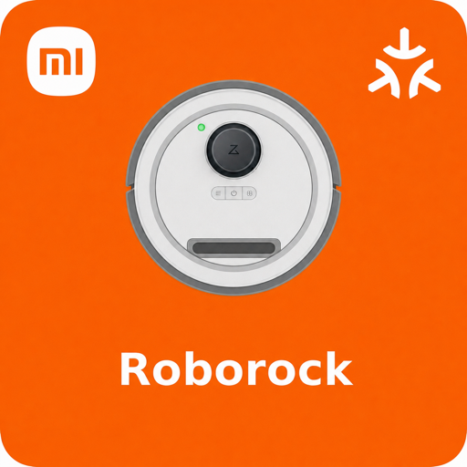

<p align="center">
  
  &nbsp;&nbsp;&nbsp;
  
</p>

<h1 align="center">Homebridge Xiaomi Roborock Matter</h1>

<p align="center">
  <a href="https://www.npmjs.com/package/homebridge-xiaomi-roborock-matter">
    
  </a>
  <a href="https://www.npmjs.com/package/homebridge-xiaomi-roborock-matter">
    
  </a>
  = 22">
  = 2">
</p>

<p align="center">
  <a href="https://www.paypal.me/hillaliy">
    
  </a>
</p>

<p align="center">
  <a href="https://github.com/homebridge/homebridge/wiki/Verified-Plugins">
    
  </a>
</p>

Expose Xiaomi Roborock vacuum cleaners as Matter Robotic Vacuum Cleaner devices through Homebridge, using local miio LAN control.

This plugin is designed to keep runtime control local. Xiaomi Cloud is not used after setup; Homebridge talks to the vacuum over your LAN and exposes it through Homebridge's built-in Matter support.

##  Features

- Matter Robotic Vacuum Cleaner accessory registration through Homebridge 2.x
- Local Roborock control over miio
- Start, pause, resume, and return-to-dock commands
- Quiet, Vacuum, Deep Clean, and Max clean modes
- Automatic LAN room discovery and Matter room selection
- Battery and operational-state updates
- miio model metadata when the vacuum reports it
- Homebridge UI configuration schema

##  Requirements

- Homebridge 2.0 or newer with Matter enabled
- Node.js 22 or newer
- Static LAN IP address for each Roborock
- 32-character miio token for each Roborock

##  Local Network Control

This plugin communicates directly with the vacuum on your local network using the Xiaomi miio protocol. Starting, pausing, docking, status polling, fan-mode changes, and room discovery do not use the Xiaomi or Roborock cloud.

Homebridge and the vacuum must be able to reach each other on the same LAN. Assign the vacuum a static DHCP lease because both its IP address and miio token are used for the connection.

##  Extracting the miio Token

The token is a 32-character hexadecimal value, for example `0123456789abcdef0123456789abcdef`. It is different from your Xiaomi account password.

### Xiaomi Cloud Tokens Extractor

1. Download and run the [Xiaomi Cloud Tokens Extractor](https://github.com/PiotrMachowski/Xiaomi-cloud-tokens-extractor).
2. Sign in with the Xiaomi account and region used by the Mi Home app.
3. Find the vacuum in the returned device list.
4. Copy its IP address and 32-character token into the Homebridge plugin settings.

### python-miio

Install [python-miio](https://github.com/rytilahti/python-miio), then start its interactive Xiaomi Cloud device lookup:

```bash
pipx install python-miio
miiocli cloud
```

Select the correct Xiaomi region and copy the token shown for the vacuum. The [Home Assistant Xiaomi Miio documentation](https://www.home-assistant.io/integrations/xiaomi_miio/#retrieving-the-access-token) also describes token retrieval methods.

Cloud access is needed only by these external extraction tools. Do not add your Xiaomi username or password to this plugin. The plugin stores only the IP address and token in the Homebridge configuration, never prints the token, and uses local miio communication during normal operation.

Some devices paired exclusively through the Roborock app may not expose a compatible Xiaomi miio token. This plugin requires a model and firmware that accept local miio commands.

##  Installation

Install from the Homebridge UI by searching for:

```text
homebridge-xiaomi-roborock-matter
```

Or install from npm:

```bash
npm install -g homebridge-xiaomi-roborock-matter
```

##  Configuration

You can configure the plugin from the Homebridge UI, or add a platform entry manually:

```json
{
  "platform": "XiaomiRoborockMatter",
  "devices": [
    {
      "name": "Living Room Vacuum",
      "ip": "192.168.1.100",
      "token": "0123456789abcdef0123456789abcdef",
      "pollInterval": 10000
    }
  ]
}
```

| Field | Required | Description |
| --- | --- | --- |
| `name` | Yes | Name shown in Matter controllers. |
| `ip` | Yes | Vacuum LAN IP address. Use a static DHCP lease. |
| `token` | Yes | 32-character hexadecimal miio token. |
| `pollInterval` | No | State refresh interval in milliseconds. Defaults to `10000`. |
| `rooms` | No | Optional room name overrides or fallback mappings. Rooms are discovered over LAN. |
| `rooms[].name` | Yes, when using rooms | Room name shown in Matter controllers. |
| `rooms[].segmentId` | Yes, when using rooms | Roborock room segment ID from the active map. |

Room support uses `get_room_mapping` and `app_segment_clean` over the LAN. On startup, the plugin discovers segment IDs and room names before registering the Matter accessory. You can omit `rooms` entirely. Manual entries override a discovered room name with the same segment ID and act as a fallback when discovery is unavailable.

### Manual Room IDs from a Disabled Timer

Some vacuums, including the Roborock S5 reported in [issue #15](https://github.com/hillaliy/Homebridge-Xiaomi-Roborock-Matter/issues/15), return an empty list from `get_room_mapping` even though room cleaning is available in Xiaomi Home. On compatible firmware, a saved cleaning schedule can reveal the segment IDs for manual configuration.

This method requires **room selection in Xiaomi Home's cleaning schedule**. It does not add room support to a vacuum that lacks it. The original `rockrobo.vacuum.v1` supports coordinate-based zone cleaning rather than segment-based room cleaning, so this is not a workaround for that model. See the [miio protocol compatibility table](https://github.com/marcelrv/XiaomiRobotVacuumProtocol).

1. In Xiaomi Home, create a cleaning schedule and select the rooms. Record their selection order and names. Choose a future time so it cannot run while you are setting it up.
2. Save the schedule and disable it. Leave it disabled throughout this procedure; midnight is not required.
3. From a computer on the vacuum's LAN, use the miio CLI with the vacuum's IP and your authenticated token setup to read the schedules. Replace the example IP below with your vacuum's IP. This command requires a separately installed miio CLI; it is not a Homebridge UI command.

   ```sh
   miio protocol call 192.168.1.100 get_timer
   ```

4. Find the disabled (`"off"`) schedule you created. Its `start_clean` parameters may contain a value such as `"segments": "16,18,19,20,17"`. These are segment IDs, not names or map coordinates. If there are several schedules, identify yours before using its IDs. If no `segments` value is returned, this method is not available from that response.
5. Match the IDs to the recorded selection order as an initial mapping. Enter them in the plugin's **Rooms** settings in Homebridge UI, or add a `rooms` property to the existing vacuum object inside `devices`. For example:

   ```json
   "rooms": [
     { "name": "Hallway", "segmentId": 16 },
     { "name": "Bathroom", "segmentId": 18 },
     { "name": "Living Room", "segmentId": 19 },
     { "name": "Bedroom", "segmentId": 20 },
     { "name": "Kitchen", "segmentId": 17 }
   ]
   ```

   This is a property to insert into your device configuration, not a complete JSON configuration. The names and IDs are examples; use your own values.

6. Save and restart Homebridge. When discovery is empty, look for `Using 5 manually configured room(s)` in the log (with your room count). Test each room individually from Apple Home to confirm the name-to-ID mapping and that cleaning targets the expected room.

The plugin does **not** read, enable, or modify timers automatically. Once the IDs are configured, you can delete the temporary schedule. The commands above and normal plugin control use LAN miio; no Xiaomi account credentials are added to the plugin. If you rebuild the map or change its room divisions, recheck the IDs. Never include your miio token when sharing command output or logs.

##  Matter Setup

Matter must be enabled in Homebridge. The plugin registers each configured Roborock as a Matter accessory through the Homebridge Matter API.

Changing cleaning intensity in Apple Home while the vacuum is running requires Homebridge support for `DirectModeChange` ([Homebridge #4001](https://github.com/homebridge/homebridge/pull/4001)). The plugin declares this capability, and support is confirmed in the published `homebridge@2.4.1-beta.11` package. As of September 30, 2026, the latest stable Homebridge release is still `2.4.0`, which does not expose this capability. To try mid-clean mode selection, use that beta or another build containing the fix; otherwise, wait for a stable release containing it. The LAN fan-speed command itself already works during cleaning.

If the vacuum does not appear:

- Confirm Homebridge Matter is enabled.
- Confirm the Homebridge Matter bridge or accessory is commissioned in your Matter controller.
- Check the Homebridge logs for Matter registration errors.

##  Supported Controls

| Matter control | Roborock action |
| --- | --- |
| Start cleaning | `app_start` |
| Pause | `app_pause` |
| Resume | `app_start` |
| Return to dock | `app_charge` |
| Quiet / Vacuum / Deep Clean / Max | `set_custom_mode` |
| Room selection | `app_segment_clean` |

Mop-specific controls are not exposed yet. Mop-capable Roborock models usually require additional model-specific miio commands, so this plugin currently presents the device as a vacuum cleaner.

##  How It Works

```text
Roborock vacuum
  <-> local miio LAN control
  <-> Homebridge plugin
  <-> Homebridge Matter
  <-> Apple Home / Google Home / other Matter controllers
```

##  Development

```bash
npm install
npm run lint
npm run build
npm pack --dry-run
```

`npm run lint` runs TypeScript in no-emit mode.

##  Troubleshooting

- `Matter is not enabled`: enable Matter in your Homebridge bridge configuration.
- `Failed to connect`: verify the vacuum IP, miio token, and LAN miio support.
- `Behaviors have errors`: update to the latest plugin version and check Homebridge Matter logs.
- Battery or status is stale: lower `pollInterval`, but avoid polling too aggressively.

##  Support Development

If this plugin is useful to you, donations help cover time spent testing devices, maintaining compatibility, and improving Homebridge Matter support.

<p>
  <a href="https://www.paypal.me/hillaliy">
    
  </a>
</p>

##  License

MIT
